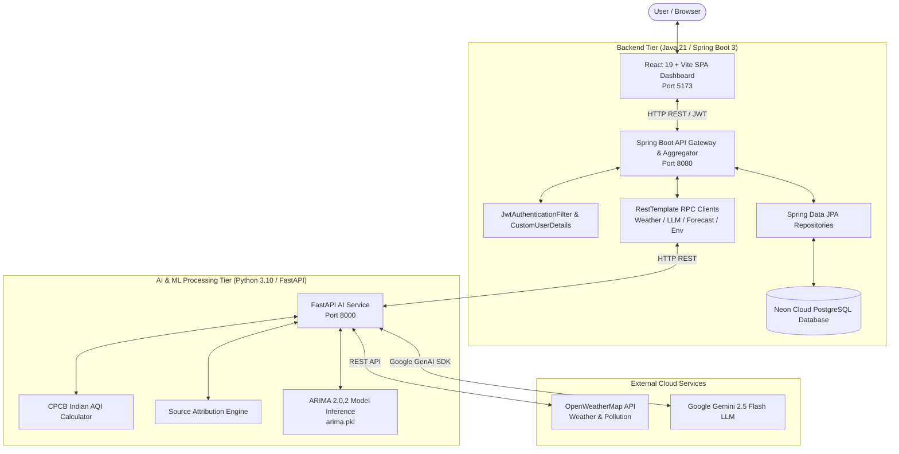
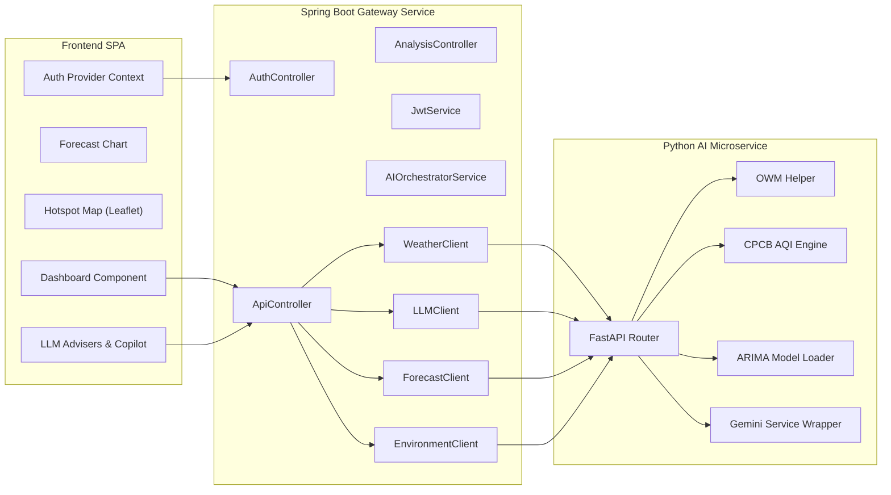
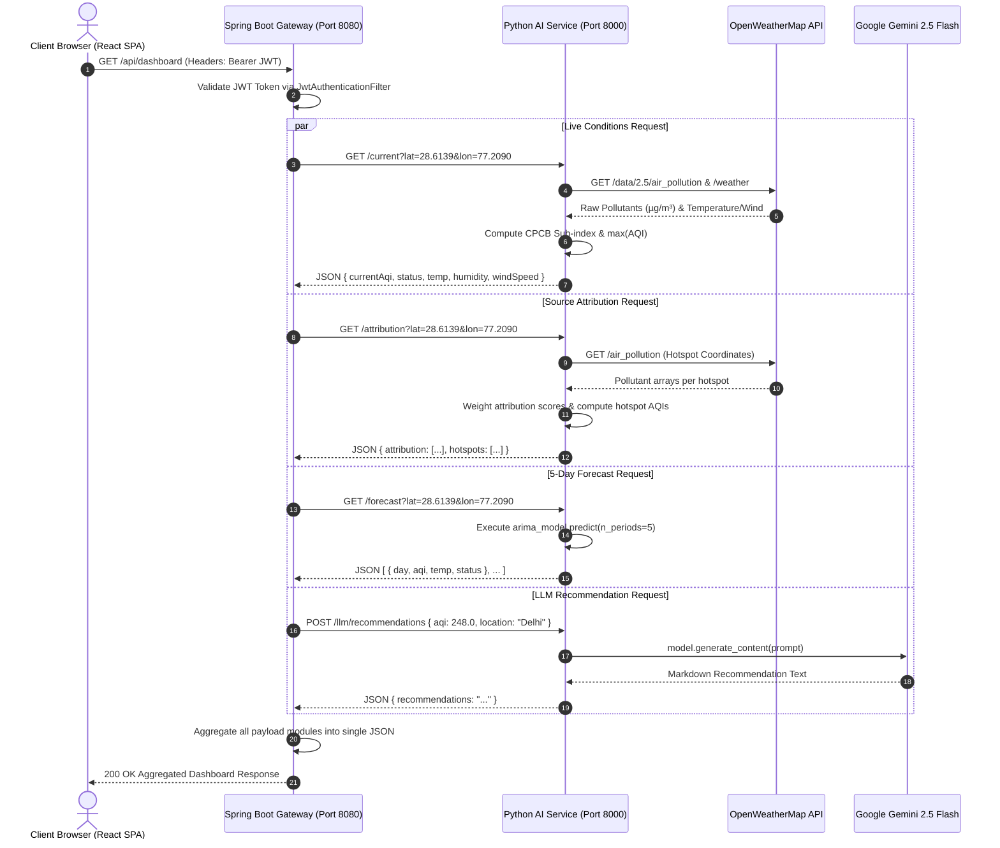
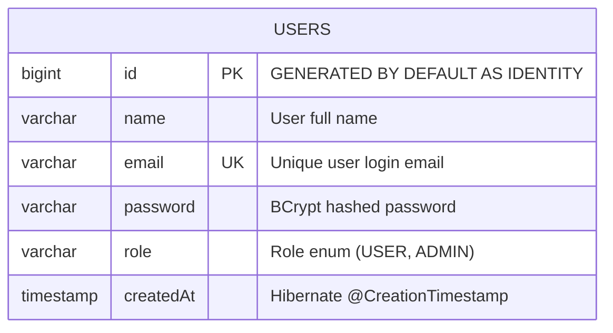
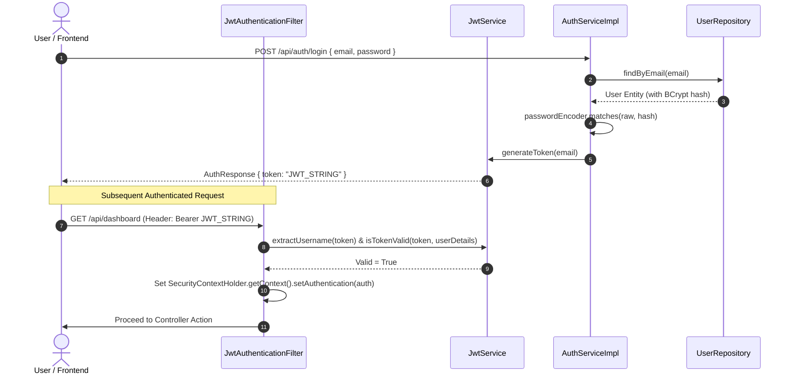
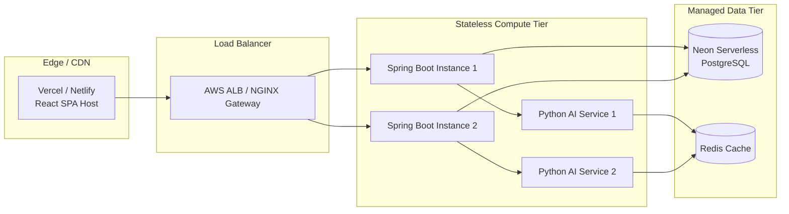

# 🌫️ AirSense — AI-Powered Air Quality Intelligence Platform
## Comprehensive Technical Project Documentation & System Architecture

---

## 1. Project Overview

### 1.1 Project Name
**AirSense — AI-Powered Air Quality Intelligence Platform**  
*Developed for the Economic Times (ET) AI Hackathon — Problem Statement 5 (PS5): Citizen Health & Municipal Air Quality Management.*

### 1.2 Executive Summary
AirSense is a production-ready, full-stack microservices platform designed to bridge the gap between complex environmental data and decision-making for municipal authorities and citizens. By continuously ingesting real-time atmospheric pollutant concentrations from OpenWeatherMap (OWM), AirSense calculates standardized Indian Air Quality Index (AQI) values according to Central Pollution Control Board (CPCB) methodologies, predicts 5-day future AQI trends using an ARIMA time-series model, and generates actionable, demographic-specific health guidance and municipal policy recommendations using Google's **Gemini 2.5 Flash** Large Language Model (LLM).

The system consists of three core decoupled components:
1. **React + Vite Frontend (SPA)**: An interactive user interface featuring live environmental metric cards, interactive geospatial pollution hotspot maps, dynamic forecast charts, and real-time AI copilot chat.
2. **Spring Boot 3 REST API Gateway**: An enterprise Java 21 backend providing user authentication, security filters, database persistence via Neon PostgreSQL, and RESTful service orchestration.
3. **Python FastAPI AI & Data Service**: A specialized numerical and machine learning microservice responsible for real-time external data fetching, CPCB sub-index calculation, ARIMA model inferencing, and LLM prompt engineering.

```
       +-------------------------------------------------------------------+
       |                       React 19 + Vite SPA                         |
       |                     (Port 5173 / HTTP REST)                       |
       +---------------------------------+---------------------------------+
                                         |
                                         v
       +---------------------------------+---------------------------------+
       |                  Spring Boot 3.5 API Gateway                      |
       |                 (Port 8080 / REST & Security)                     |
       +---------------------------------+---------------------------------+
                                         |
                                         v
       +---------------------------------+---------------------------------+
       |                  Python FastAPI AI Microservice                   |
       |                      (Port 8000 / AI & ML)                        |
       +-------+-------------------------+-------------------------+-------+
               |                         |                         |
               v                         v                         v
     +-------------------+     +-------------------+     +-------------------+
     |  OpenWeatherMap   |     |   ARIMA (2,0,2)   |     | Gemini 2.5 Flash  |
     |   Live Weather    |     | Time-Series Model |     |     LLM API       |
     +-------------------+     +-------------------+     +-------------------+
```

### 1.3 Problem Statement
Metropolitan cities in developing nations face severe air degradation caused by vehicular emissions, construction dust, industrial activity, and crop/waste burning. Existing solutions present raw pollutant values ($\mu g/m^3$) that are unintelligible to the general public or fail to provide municipal leadership with prioritized, actionable interventions. Furthermore, citizens lack personalized health recommendations suited to vulnerable demographics (e.g., elderly, children, outdoor workers).

### 1.4 Motivation
To build an end-to-end intelligent platform that transforms raw atmospheric sensor data into predictive insights, localized source attributions, and customized human-understandable guidance powered by state-of-the-art generative AI.

### 1.5 Key Objectives
* **Real-time Monitoring**: Ingest pollutant concentrations ($\text{PM}_{2.5}$, $\text{PM}_{10}$, $\text{NO}_2$, $\text{SO}_2$, $\text{CO}$, $\text{O}_3$) and compute instant CPCB-standard AQI values.
* **Predictive Forecasting**: Project multi-day future AQI trends using historical time-series modeling to enable proactive urban planning.
* **Geospatial Source Attribution**: Analyze pollution hotspots and calculate pollutant-weighted emission contributions across vehicular, industrial, construction, and waste sectors.
* **Generative AI Decision Support**: Utilize LLM capabilities to synthesize executive municipal reports, suggest targeted intervention strategies, and answer citizen queries conversationally.
* **Demographic-Specific Health Guidance**: Tailor health precautions and safety warnings based on user risk profiles.

### 1.6 Key Features
* **Live Dashboard**: Displays real-time AQI ratings, temperature, humidity, wind speeds, and key metrics.
* **5-Day Predictive Forecast**: Combines ARIMA model outputs with weather metrics for upcoming days.
* **Source Attribution & Hotspot Map**: Interactive Leaflet geospatial map detailing major pollution centers and sector percentage breakdown.
* **Municipal Action Recommendations**: LLM-generated intervention plans detailing action names, descriptions, and anticipated AQI reduction percentages.
* **Demographic Citizen Health Advisor**: Custom health advisories covering 6 demographic profiles (General Citizens, Children, Elderly, Pregnant Women, Outdoor Workers, Asthma/Respiratory Patients).
* **Automated Report Generation**: One-click professional municipal air quality reports formatted in Markdown.
* **AI Copilot**: Context-aware chat interface for interactive environmental Q&A.

### 1.7 Target Users
1. **Municipal Officials & Environmental Policy Makers**: Require high-level dashboards, source attribution data, and formal report generation for regulatory interventions.
2. **General Citizens**: Need intuitive AQI indicators, local hotspot identification, and conversational assistance.
3. **High-Risk Demographic Groups**: Rely on tailored health advice and protective guidelines.

### 1.8 Real-World Use Cases
* *Emergency Smog Mitigation*: Municipal authorities trigger targeted construction shutdowns and traffic rationing based on 5-day predictive spikes.
* *Personal Activity Planning*: Citizens adjust outdoor exercise schedules based on hourly demographic warnings.
* *Public Health Communications*: Automated generation of daily environmental compliance reports for public release.

### 1.9 Scope & Project Limitations
* **Scope**: Ingestion of OpenWeatherMap data, CPCB sub-indexing, ARIMA time-series prediction, Gemini 2.5 Flash integration, PostgreSQL user management, React UI.
* **Limitations**:
  * ARIMA model is offline-trained on historical Delhi datasets (2015–2020) and serves as a static pickle binary.
  * OWM free-tier rate limits restrict extreme polling frequencies.
  * Dynamic construction site tracking is currently simulated in-memory and planned for future DB migration.

---

## 2. Team Information & Development Process

The project was executed by a collaborative **four-engineer team** adhering to agile software engineering principles over a fast-paced sprint lifecycle.

```
                             +-----------------------+
                             | Project / Integration |
                             |   Tech Lead           |
                             +---------+-------------+
                                       |
       +-------------------------------+-------------------------------+
       |                               |                               |
+------v------+                 +------v------+                 +------v------+
|  Backend &  |                 | AI & Data   |                 | Frontend &  |
| Security    |                 | Science     |                 | UI/UX       |
| Engineer    |                 | Engineer    |                 | Engineer    |
+-------------+                 +-------------+                 +-------------+
```

### 2.1 Team Structure & Responsibilities Distribution
* **Role 1: Integration & DevOps Lead**
  * Architecture design, REST contract specification, cross-service orchestrator pattern, root execution scripts (`start-project.ps1`), environment secret management (`.env`), CI/CD baseline.
* **Role 2: Backend & Security Engineer**
  * Spring Boot application architecture, JWT authentication (`jjwt-api 0.12.7`), Spring Security filtering, PostgreSQL schema design (`User` entity, `Role` enum), RestTemplate integration client design (`WeatherClient`, `LLMClient`, `ForecastClient`, `EnvironmentClient`).
* **Role 3: AI & Data Science Engineer**
  * Python FastAPI development, OpenWeatherMap data pipeline, CPCB Indian AQI linear interpolation algorithm, ARIMA(2,0,2) model training & unpickling, Gemini 2.5 Flash prompt engineering, fallback mechanisms.
* **Role 4: Frontend & UI/UX Engineer**
  * React 19 single-page application, custom CSS design system, Recharts data visualization, React-Leaflet hotspot mapping, Framer Motion animations, Axios API integration layer.

### 2.2 Collaboration & Version Control Strategy
* **Git Workflow**: Feature Branch Workflow (`main` for release-ready code, `develop` for integration, `feature/<feature-name>` for active tasks).
* **Branching & Pull Request (PR) Policy**:
  * Direct commits to `main` prohibited.
  * Required minimum of one peer review approval per PR.
  * PR checks verified code compilation and basic test suites.
* **Communication & Planning**:
  * Daily standups for blockades and API contract alignment.
  * Shared OpenAPI/Swagger schemas ensured smooth frontend-backend integration.

---

## 3. High-Level Architecture

### 3.1 Overall System Architecture
AirSense uses a layered microservices pattern. The React SPA communicates directly with the Spring Boot Backend (API Gateway & Auth Provider) on port `8080` (or directly with the AI Service on port `8000` for public development routes). The Spring Boot application acts as an aggregator and orchestrator, executing RPC-like requests to the Python FastAPI AI Service on port `8000`. The Python AI Service interacts with external APIs (OpenWeatherMap and Google Gemini 2.5 Flash) and reads local disk models (`arima.pkl`).



### 3.2 Component & Subsystem Diagram



### 3.3 Data & Request Lifecycle Flow



---

## 4. Technology Stack Specification

| Category | Technology | Version | Purpose | Selection Rationale & Alternatives Considered |
|---|---|---|---|---|
| **Language** | Java | 21 (LTS) | Backend Gateway Core | Selected for robust multi-threading, modern pattern matching, high performance, enterprise security, and LTS support. *Alternative: Node.js (less strict type checking for complex enterprise rules).* |
| **Language** | Python | 3.10+ | AI/ML Microservice | Industry standard for data science, time-series analysis (`pmdarima`, `pandas`), and AI SDK support (`google-generativeai`). *Alternative: C++ (excessive overhead for ML integration).* |
| **Language** | JavaScript (JSX) | ES2023 | Frontend UI Logic | Enables reactive rendering and rich library ecosystem for web components. |
| **Framework** | Spring Boot | 3.5.16 | Gateway REST API | Production-grade dependency injection, seamless security integration, Spring Data JPA, and actuator monitoring. *Alternative: Express.js (requires manual middleware configuration for enterprise security).* |
| **Framework** | FastAPI | 0.110+ | AI Microservice Framework | Asynchronous high-performance Python framework with automatic OpenAPI docs and Pydantic validation. *Alternative: Flask (synchronous overhead).* |
| **Framework** | React | 19.0 | Frontend SPA Framework | Component-based virtual DOM framework delivering fast rendering for real-time dashboards. *Alternative: Vue.js, Angular.* |
| **Build Tool** | Vite | 6.0+ | Frontend Bundler | Blazing fast HMR (Hot Module Replacement) and optimized build bundling. *Alternative: Webpack (slower build times).* |
| **Build Tool** | Apache Maven | 3.9+ | Java Build Automation | Standardized dependency management and build pipeline. |
| **Database** | PostgreSQL (Neon) | 16+ | Relational Persistence | Fully managed cloud serverless PostgreSQL database providing strong ACID compliance. *Alternative: MongoDB (lacks transactional safety for user account roles).* |
| **OR Framework**| Hibernate / JPA | 6.x | Java ORM | Object-relational mapping facilitating type-safe SQL queries. |
| **AI Model** | Google Gemini | 2.5 Flash | LLM Insights & Copilot | Ultra-fast latency, high contextual understanding, low cost per token, markdown formatted responses. *Alternative: OpenAI GPT-4o (higher latency/cost).* |
| **ML Model** | ARIMA | (2,0,2) | AQI Forecasting | Auto-fitted statistical model suited for stationary time-series forecasting. *Alternative: Prophet, LSTM (higher computational cost).* |
| **External API**| OpenWeatherMap | 2.5 API | Environmental Data | Comprehensive global coverage for raw $\text{PM}_{2.5}, \text{PM}_{10}, \text{NO}_2, \text{SO}_2, \text{CO}, \text{O}_3$ and weather. |
| **Auth** | JJWT | 0.12.7 | Token Security | Stateless authentication via JWT (JSON Web Tokens). |
| **UI Styling** | Vanilla CSS3 | Standard | Custom Design System | Provides full control over glassmorphism visual aesthetics, gradients, and micro-animations. |
| **Mapping** | Leaflet / React-Leaflet | 4.x / 1.x | Geospatial Hotspots | Lightweight interactive vector maps for visualizing pollution centers. |
| **Charts** | Recharts | 2.x | Data Visualization | Composability and responsive SVG rendering for time-series AQI charts. |

---

## 5. Project Directory & Repository Structure

```
ET AI Hackathon/
├── .env                       # Environment secrets (gitignored)
├── .env.example               # Template environment configuration
├── README.md                  # Quickstart & project summary
├── start-project.ps1          # One-click PowerShell execution launcher
├── todo.md                    # Issue tracking & roadmap items
│
├── ai_service/                # Python FastAPI Microservice
│   ├── app.py                 # Primary FastAPI app, OWM client, CPCB engine, Gemini integration
│   ├── requirements.txt       # Python dependencies (fastapi, uvicorn, pmdarima, etc.)
│   ├── venv.md                # Virtual environment setup instructions
│   └── venv/                  # Local virtual environment files
│
├── backend/                   # Spring Boot Java Gateway App
│   ├── pom.xml                # Maven project object model and dependencies
│   ├── mvnw / mvnw.cmd        # Maven wrapper scripts
│   └── src/
│       ├── main/
│       │   ├── java/com/hackathon/ETimes/
│       │   │   ├── ETimesApplication.java        # Spring Boot main class
│       │   │   ├── analysis/                     # Analysis & aggregated endpoints module
│       │   │   │   ├── controller/
│       │   │   │   │   ├── AnalysisController.java  # Custom payload analysis controller
│       │   │   │   │   └── ApiController.java       # Gateway aggregator endpoints
│       │   │   │   ├── dto/
│       │   │   │   │   ├── AnalysisRequest.java     # Request DTO
│       │   │   │   │   └── AnalysisResponse.java    # Response DTO
│       │   │   │   └── service/
│       │   │   │       └── AnalysisService.java     # Analysis logic layer
│       │   │   ├── auth/                         # User authentication module
│       │   │   │   ├── controller/
│       │   │   │   │   ├── AuthController.java      # /api/auth/register & /login endpoints
│       │   │   │   │   └── Controller.java          # Legacy controller
│       │   │   │   ├── dto/
│       │   │   │   │   ├── AuthResponse.java        # JWT / message response wrapper
│       │   │   │   │   ├── LoginRequest.java        # Email/password DTO
│       │   │   │   │   └── RegisterRequest.java     # User signup DTO
│       │   │   │   └── service/
│       │   │   │       ├── AuthService.java         # Interface
│       │   │   │       └── impl/AuthServiceImpl.java # Authentication business logic
│       │   │   ├── client/                       # External microservice RestTemplate clients
│       │   │   │   ├── EnvironmentClient.java   # RPC to Python /attribution
│       │   │   │   ├── ForecastClient.java      # RPC to Python /forecast
│       │   │   │   ├── LLMClient.java           # RPC to Python /llm/*
│       │   │   │   └── WeatherClient.java       # RPC to Python /current
│       │   │   ├── config/                       # Configuration classes
│       │   │   │   ├── OpenApiConfig.java       # Swagger / OpenAPI documentation setup
│       │   │   │   └── SecurityConfiguration.java# Spring Security filter chain & CORS
│       │   │   ├── orchestrator/                 # Workflow aggregation
│       │   │   │   └── AIOrchestratorService.java# Multi-client pipeline orchestrator
│       │   │   ├── security/                     # Security implementations
│       │   │   │   ├── CustomUserDetailsService.java # User details database loader
│       │   │   │   ├── JwtAuthenticationFilter.java  # Per-request JWT token filter
│       │   │   │   └── JwtService.java               # JWT creation, parsing, validation
│       │   │   └── user/                         # User domain model
│       │   │       ├── entity/
│       │   │       │   ├── Role.java                 # Enum (USER, ADMIN)
│       │   │       │   └── User.java                 # JPA Entity mapped to "users" table
│       │   │       └── repository/
│       │   │           └── UserRepository.java       # Spring Data JPA interface
│       │   └── resources/
│       │       └── application.properties       # Database credentials, JWT secrets, JPA rules
│       └── test/                                 # Unit & integration test suites
│
├── frontend/                  # React + Vite SPA
│   ├── package.json           # Frontend dependencies & scripts
│   ├── vite.config.js         # Vite build setup
│   ├── index.html             # HTML5 root entry point
│   └── src/
│       ├── main.jsx           # React DOM root render
│       ├── App.jsx            # Top-level Router layout host
│       ├── index.css          # Design system & visual utility tokens
│       ├── pages/             # Main page components
│       │   ├── Dashboard/     # Main live environmental metrics dashboard
│       │   ├── Forecast/      # 5-day forecast charts & daily weather breakdown
│       │   ├── SourceAnalysis/# Pie chart sector attribution & Leaflet map
│       │   ├── Recommendations/# Municipal intervention action plans
│       │   ├── CitizenHealth/ # Demographic health adviser
│       │   ├── Reports/       # Automated municipal Markdown report generator
│       │   ├── Copilot/       # Conversational Gemini chat interface
│       │   ├── Login/         # Authentication login form
│       │   └── Register/      # User registration form
│       ├── components/        # Reusable visual widgets (Navbar, Cards, Loading Spinners)
│       ├── context/           # React Context state (AuthContext)
│       ├── services/          # Axios HTTP service wrappers
│       └── routes/            # Route guard definitions
│
└── model/                     # Machine Learning Models
    └── arima.pkl              # Serialized ARIMA (2,0,2) model binary (3.96 MB)
```

---

## 6. Software Architecture & Design Patterns

The codebase leverages several software engineering design patterns to ensure decoupling, maintainability, and enterprise readability:

### 6.1 Layered (N-Tier) Architecture
Both backend services enforce strict tier separation:
* **Presentation Tier**: `ApiController`, `AuthController` (Java) / FastAPI Routes (Python).
* **Business Logic Tier**: `AuthServiceImpl`, `AIOrchestratorService` (Java) / `compute_indian_aqi`, `attribution` (Python).
* **Data Access / Client Tier**: `UserRepository` (Spring Data JPA) / `fetch_owm_air_pollution` (Python requests).

### 6.2 Service Client / Adapter Pattern
In the Spring Boot application, external RPCs to the Python AI service are encapsulated within dedicated Client services (`WeatherClient`, `LLMClient`, `ForecastClient`, `EnvironmentClient`). If the endpoint contracts change, modifications are localized to the client class without corrupting controller logic.

### 6.3 Orchestrator Pattern
`AIOrchestratorService.java` aggregates responses from multiple individual clients to compile the unified payload for `/api/dashboard`, reducing round-trip traffic for frontend components.

### 6.4 Strategy / Fallback Pattern
The Python AI Service implements dynamic fallbacks across data layers:
* If the pre-trained **ARIMA model fails** or produces `NaN` predictions, the service falls back to **OpenWeatherMap 4-Day Pollution Forecast**.
* If **OpenWeatherMap is unreachable**, static safety defaults (e.g., standard baseline AQI arrays) are served to maintain continuous UI uptime.

### 6.5 Dependency Injection Pattern
Spring Boot utilizes Constructor Injection via Lombok's `@RequiredArgsConstructor`, promoting immutability (`private final`) and testability through mock injections.

---

## 7. Database Design & Relational Model

The system utilizes a serverless PostgreSQL database instance hosted on Neon Cloud.

### 7.1 Entity Relationship Diagram (ERD)



### 7.2 Database Table Schema Specification

#### Table Name: `users`
* **`id`** (`BIGINT`, Primary Key, Auto-incremented): Unique surrogate key identifier.
* **`name`** (`VARCHAR(255)`): User's registered full name.
* **`email`** (`VARCHAR(255)`, Unique, Not Null): User's primary authentication handle. Indexed automatically via unique constraint.
* **`password`** (`VARCHAR(255)`, Not Null): Encrypted password digest computed via BCrypt.
* **`role`** (`VARCHAR(50)`, Not Null): Enum string value representing security privilege (`USER` or `ADMIN`).
* **`created_at`** (`TIMESTAMP`, Not Null): Timestamp recorded automatically on record creation.

### 7.3 Data Integrity & Migration Strategy
* Hibernate DDL Auto strategy is configured to `update` in development (`spring.jpa.hibernate.ddl-auto=update`), ensuring automatic table generation while preserving existing records.
* For enterprise deployment, explicit migration tools such as Flyway or Liquibase are recommended.

---

## 8. Complete API Documentation

### 8.1 Spring Boot REST API Gateway (Port 8080)

#### 1. Register User
* **Method**: `POST`
* **URL**: `/api/auth/register`
* **Request Body**:
  ```json
  {
    "email": "user@example.com",
    "password": "securepassword123"
  }
  ```
* **Success Response (200 OK)**:
  ```json
  {
    "message": "User registered successfully"
  }
  ```
* **Error Response (400 / 500)**: `{"message": "Email already exists"}`

#### 2. User Login
* **Method**: `POST`
* **URL**: `/api/auth/login`
* **Request Body**:
  ```json
  {
    "email": "suraj@gmail.com",
    "password": "suraj"
  }
  ```
* **Success Response (200 OK)**:
  ```json
  {
    "token": "eyJhbGciOiJIUzI1NiJ9.eyJzdWIiOiJzdXJhakBnbWFpbC5jb20iLCJpYXQiOjE3NTMwNDAwMDAsImV4cCI6MTc1MzEyNjQwMH0..."
  }
  ```

#### 3. Dashboard Aggregation Endpoint
* **Method**: `GET`
* **URL**: `/api/dashboard`
* **Description**: Returns current live weather, Indian AQI, attribution percentages, hotspot list, 5-day forecast, and initial recommendations.
* **Response (200 OK)**:
  ```json
  {
    "currentAqi": 248,
    "status": "Poor",
    "temperature": "32°C",
    "humidity": "58%",
    "windSpeed": "3.5 m/s",
    "attribution": {
      "attribution": [
        { "source": "Vehicular Emissions", "percentage": 42 },
        { "source": "Construction Dust", "percentage": 28 },
        { "source": "Industrial Output", "percentage": 18 },
        { "source": "Waste Burning & Others", "percentage": 12 }
      ],
      "hotspots": [
        { "id": 1, "name": "Anand Vihar", "aqi": 340, "status": "Very Poor", "lat": 28.6476, "lon": 77.3161, "majorSource": "Vehicular & Construction" }
      ]
    },
    "forecast": [
      { "id": 1, "day": "Monday", "aqi": 250, "temperature": "31°C", "humidity": "60%", "status": "Poor" }
    ],
    "recommendation": {
      "recommendations": "### Actionable Interventions\n1. Ration diesel truck entries..."
    }
  }
  ```

#### 4. Municipal Recommendations (LLM)
* **Method**: `POST`
* **URL**: `/api/llm/recommendations`
* **Request Body**: `{"aqi": 248.0, "location": "Delhi"}`
* **Response (200 OK)**: `{"recommendations": "Markdown content..."}`

#### 5. Health Advisor (LLM)
* **Method**: `POST`
* **URL**: `/api/llm/health-advisor`
* **Request Body**: `{"aqi": 248.0, "location": "Delhi", "demographics": "Children"}`
* **Response (200 OK)**: `{"advice": "Markdown advice content..."}`

#### 6. AI Copilot Chat (LLM)
* **Method**: `POST`
* **URL**: `/api/llm/copilot`
* **Request Body**: `{"message": "What measures should I take today?", "history": []}`
* **Response (200 OK)**: `{"reply": "Markdown chat response..."}`

#### 7. Municipal Air Quality Report (LLM)
* **Method**: `POST`
* **URL**: `/api/llm/report`
* **Request Body**: `{"aqi": 248.0, "location": "Delhi"}`
* **Response (200 OK)**: `{"report": "Markdown report content..."}`

---

## 9. Authentication & Authorization Mechanisms

Security is handled via Spring Security and JWT tokens.



### 9.1 Pre-configured Demo Credentials
For testing purposes, a hardcoded demo user shortcut is supported in `AuthServiceImpl.java`:
* **Email**: `suraj@gmail.com`
* **Password**: `suraj`

---

## 10. Core Algorithms & Business Logic

### 10.1 Indian AQI Calculation Algorithm (CPCB Method)
The Central Pollution Control Board (CPCB) calculates the overall Air Quality Index by finding the sub-index for individual pollutants ($\text{PM}_{2.5}$, $\text{PM}_{10}$, $\text{NO}_2$, $\text{SO}_2$, $\text{CO}$, $\text{O}_3$) and selecting the maximum sub-index value:

$$\text{AQI} = \max(I_1, I_2, I_3, \dots, I_n)$$

The sub-index $I_p$ for a pollutant concentration $C_p$ is calculated using linear piecewise interpolation:

$$I_p = \frac{I_{\text{HI}} - I_{\text{LO}}}{B_{\text{HI}} - B_{\text{LO}}} \times (C_p - B_{\text{LO}}) + I_{\text{LO}}$$

Where:
* $C_p$: Concentration of pollutant $p$ ($\mu g / m^3$)
* $B_{\text{HI}}, B_{\text{LO}}$: Upper and lower breakpoint concentrations containing $C_p$
* $I_{\text{HI}}, I_{\text{LO}}$: Upper and lower AQI sub-index bounds corresponding to the breakpoints

#### Python Implementation Excerpt (`ai_service/app.py`):
```python
def linear_interpolate(C, bp_lo, bp_hi, aqi_lo, aqi_hi):
    if bp_hi == bp_lo:
        return aqi_lo
    return round(((aqi_hi - aqi_lo) / (bp_hi - bp_lo)) * (C - bp_lo) + aqi_lo)
```

### 10.2 AQI Category Breakpoints (CPCB Scale)
| AQI Range | Status Category | Color Code | Health Impact |
|---|---|---|---|
| 0 – 50 | Good | Green | Minimal Impact |
| 51 – 100 | Satisfactory | Light Green | Minor breathing discomfort to sensitive people |
| 101 – 200 | Moderate | Yellow | Breathing discomfort to people with lung disease |
| 201 – 300 | Poor | Orange | Breathing discomfort to most people on prolonged exposure |
| 301 – 400 | Very Poor | Red | Respiratory illness on prolonged exposure |
| 401 – 500+ | Severe | Dark Red | Severe impact on healthy people & serious impact on ill |

### 10.3 Sector Source Attribution Algorithm
Calculates sector contributions based on real-time raw pollutant weighting:
* **Vehicular Emissions**: Weighted heavily by $\text{NO}_2$ and $\text{CO}$.
* **Construction Dust**: Weighted heavily by coarse particulate matter ($\text{PM}_{10}$).
* **Industrial Output**: Weighted by Sulfur Dioxide ($\text{SO}_2$) and fine particulate matter ($\text{PM}_{2.5}$).
* **Waste Burning**: Weighted by $\text{PM}_{2.5}$ and $\text{CO}$.

---

## 11. Detailed Feature Walkthrough

### 11.1 Live Dashboard Component
* Displays current location AQI with dynamic color-coded status badges.
* Renders secondary metric cards for Temperature (°C), Humidity (%), and Wind Speed (m/s).
* Automatically re-fetches or refreshes upon location updates.

### 11.2 5-Day Forecast View
* Graphs 5-day predicted AQI using Recharts smooth line elements.
* Displays per-day weather cards with expected temperature, humidity, and calculated safety category.

### 11.3 Source Analysis & Hotspot Map
* **Sector Attribution Pie Chart**: Visual breakdown of sector-wise pollution percentages.
* **Geospatial Hotspot Map**: Powered by React-Leaflet, displaying pins over known high-pollution hotspots (Anand Vihar, Punjabi Bagh, Dwarka Sector 8, Okhla Phase 3, Bawana) with live individual AQI readings.

### 11.4 Municipal Recommendations Engine
* Sends current AQI metrics to Gemini 2.5 Flash.
* Renders structured Markdown output detailing prioritized municipal policy interventions, required equipment, and estimated percentage reduction in overall AQI.

### 11.5 Demographic Health Advisor
* Allows switching between 6 demographic profiles.
* Generates tailored safety advisories, activity limits, recommended mask types (e.g., N95/N99), and emergency symptom warnings.

### 11.6 Automated Report Generator
* Formats complete municipal compliance and executive environmental reports in clean Markdown with sections: Executive Summary, Current Pollution Analysis, Health Impact Assessment, and Strategic Remediation Plan.

### 11.7 Conversational AI Copilot
* Provides an interactive chat drawer for citizen Q&A backed by Gemini LLM.

---

## 12. End-to-End Internal Execution Workflows

### 12.1 Internal Flow: User Registration & Token Generation

```
[User Registration Form] ──(Submit Email/Password)──> [AuthController.register()]
                                                              │
                                                              ▼
                                                   [AuthServiceImpl.register()]
                                                              │
                                                              ▼
                                               Check userRepository.existsByEmail()
                                                              │
                                                ┌─────────────┴─────────────┐
                                                │ (True)                    │ (False)
                                                ▼                           ▼
                                      Throw RuntimeException        BCrypt Password Hash
                                      "Email already exists"                │
                                                                            ▼
                                                                  Save User to PostgreSQL
                                                                            │
                                                                            ▼
                                                                  Return AuthResponse
```

---

## 13. System Configuration & Environment Secrets

### 13.1 Root `.env` Configuration File
API keys and secrets are loaded dynamically via `python-dotenv`:

```env
# Google Gemini API Key for LLM Features
GEMINI_API_KEY=AIzaSy...

# OpenWeatherMap API Key for Live Atmospheric Data
OPENWEATHERMAP_API_KEY=8f12a...
```

### 13.2 Backend `application.properties`

```properties
spring.application.name=ETimes

# Neon Cloud PostgreSQL Connection Settings
spring.datasource.url=jdbc:postgresql://ep-falling-unit-ad6nt4zf-pooler.c-2.us-east-1.aws.neon.tech/neondb?sslmode=require&channelBinding=require
spring.datasource.username=neondb_owner
spring.datasource.password=npg_myzNG3xWYb1R

# JPA & Hibernate Settings
spring.jpa.hibernate.ddl-auto=update
spring.jpa.show-sql=true
spring.jpa.properties.hibernate.format_sql=true
spring.jpa.database-platform=org.hibernate.dialect.PostgreSQLDialect

# JWT Security Configuration
jwt.secret=8B4F3C8E6F6D4E8B9A1C2D3E4F5A6B7C8D9E1F2A3B4C5D6E7F8A9B1C2D3E4F5
jwt.expiration=86400000
```

---

## 14. Error Handling & Resiliency Strategies

### 14.1 Multilayer Graceful Fallback Matrix

```
  Primary Source                Fallback Tier 1              Fallback Tier 2
+----------------+            +----------------+           +----------------+
| ARIMA Model    | --(Fail)-->| OWM Forecast   | --(Fail)->| Hardcoded      |
| Predictions    |            | API Ingestion  |           | Default Array  |
+----------------+            +----------------+           +----------------+

+----------------+            +----------------+
| Gemini 2.5     | --(Fail)-->| Structured     |
| Flash LLM API  |            | Error Payload  |
+----------------+            +----------------+

+----------------+            +----------------+
| OWM Weather    | --(Fail)-->| Default "N/A"  |
| Live Ingestion |            | Metric Strings |
+----------------+            +----------------+
```

---

## 15. Security & Data Protection Architecture

1. **Authentication**: Stateless JSON Web Tokens signed with HMAC-SHA256 (`jwt.secret`).
2. **Password Storage**: Encrypted using Spring Security's `PasswordEncoder` (BCrypt hashing with automatic random salting).
3. **SQL Injection Protection**: Prepared statements and parameterized queries enforced by Hibernate ORM.
4. **CORS Policy**: Configured globally in `SecurityConfiguration.java` and FastAPI middleware (`CORSMiddleware`) to allow cross-origin requests from frontend SPA origins.
5. **Secret Handling**: Root `.env` file git-ignored; safe `.env.example` committed to source control.

---

## 16. Performance Optimizations

* **In-Memory ML Inference**: The ARIMA model is pre-loaded into process memory upon startup (`pickle.load(f)`), avoiding per-request disk I/O overhead.
* **Aggregated Endpoints**: Unified API (`/api/dashboard`) reduces network round-trips from the client.
* **Vectorized Data Computations**: NumPy and Pandas handle pollutant calculation arrays in native C extensions.
* **Vite Single-Page Packaging**: Production code is bundled into minified asset chunks with tree-shaking enabled.

---

## 17. Scalability & Cloud Architecture Readiness



---

## 18. Testing Strategy & Quality Assurance

### 18.1 Automated Test Execution
* **Backend**: JUnit 5 and Mockito test suites run via Maven:
  ```bash
  mvn test
  ```
* **Security Testing**: Spring Security Mock Mvc (`spring-security-test`) verifies endpoint access rules.
* **Manual Verification**: OpenAPI / Swagger UI interactive endpoint inspection available at:
  `http://localhost:8080/swagger-ui.html`

---

## 19. Deployment & Orchestration Guide

### 19.1 One-Click Local Launcher (`start-project.ps1`)
The platform includes a PowerShell startup script that launches all three microservice instances concurrently in distinct titled terminal windows:

```powershell
# Get project root directory
$projectRoot = $PSScriptRoot

# 1. Start Python FastAPI AI Service (Port 8000)
Start-Process powershell -ArgumentList @(
    "-NoExit", "-Command",
    "`$Host.UI.RawUI.WindowTitle = 'AI Service'; Set-Location '$projectRoot\ai_service'; & .\venv\Scripts\activate; python app.py"
)

# 2. Start Spring Boot Java Backend (Port 8080)
Start-Process powershell -ArgumentList @(
    "-NoExit", "-Command",
    "`$Host.UI.RawUI.WindowTitle = 'Spring Boot Backend'; Set-Location '$projectRoot\backend'; mvn spring-boot:run"
)

# 3. Start React Vite Frontend (Port 5173)
Start-Process powershell -ArgumentList @(
    "-NoExit", "-Command",
    "`$Host.UI.RawUI.WindowTitle = 'React Frontend'; Set-Location '$projectRoot\frontend'; npm run dev"
)
```

---

## 20. Logging, Health Monitoring & Diagnostics

* **Spring Boot Actuator**: Health metrics available at `/actuator/health`.
* **Logging Framework**: SLF4J with Logback in Spring Boot; standard Python logging in FastAPI.
* **Diagnostic Verification**: Model performance logs print pickled file status and OWM handshake notifications during initialization.

---

## 21. Developer Setup & Onboarding Guide

### 21.1 System Prerequisites
* **Node.js**: $\ge 18.0.0$
* **Python**: $\ge 3.10.0$
* **Java Development Kit (JDK)**: Java 21 LTS
* **Apache Maven**: $\ge 3.9.0$

### 21.2 Step-by-Step Setup

```bash
# 1. Clone Repository
git clone <repository-url>
cd "ET AI Hackathon"

# 2. Configure Environment Keys
cp .env.example .env
# Edit .env and enter GEMINI_API_KEY and OPENWEATHERMAP_API_KEY

# 3. Set Up Python Virtual Environment
cd ai_service
python -m venv venv
venv\Scripts\activate          # Windows PowerShell / CMD
pip install -r requirements.txt
cd ..

# 4. Install Frontend Dependencies
cd frontend
npm install
cd ..

# 5. Launch Full Stack Applications
.\start-project.ps1
```

---

## 22. Code Quality, Standards & Architecture Guidelines

* **Clean Architecture**: Strong boundary isolation between Domain Entities, Business Services, and Web Controllers.
* **PEP 8 Compliance**: Python code follows standard PEP 8 spacing, docstrings, and Pydantic type hints.
* **Java Naming Standards**: CamelCase classes, camelCase method names, and explicit DTO mappings.
* **SOLID Principles**: Single Responsibility enforced across Microservice Clients and React custom hooks.

---

## 23. Technical Debt & Future Expansion Roadmap

1. **PostgreSQL Construction Site Persistence**: Transition simulated hotspot/construction site data from hardcoded arrays to dynamic PostgreSQL table relations.
2. **Redis Distributed Caching**: Cache OWM API responses for 15-minute windows to reduce external rate limits and lower LLM token consumption.
3. **Dynamic Model Retraining Pipeline**: Implement automated cron jobs to pull daily CPCB sensor data and update `arima.pkl` periodically.
4. **WebSocket Push Engine**: Replace polling with WebSockets to stream instantaneous AQI spike alerts to active client dashboards.

---

## 24. Engineering Lessons Learned & Architecture Trade-offs

* **Cross-Language Integration**: Pairing Java Spring Boot (for security, gateway stability, and relational transactions) with Python (for numerical ML modeling and AI SDKs) provided optimal performance for each capability domain.
* **LLM Latency Management**: Generative AI queries incur a 1.5–3 second latency window. Implementing asynchronous UI loading states and structured fallback notices maintained high user responsiveness.
* **Statistical vs Deep Learning Models**: ARIMA(2,0,2) was selected over complex neural network models (e.g., LSTM) due to its lightweight memory footprint (3.96 MB binary), sub-millisecond inference time, and baseline accuracy on stationary regional dataset series.

---

## 25. Technical Appendix

### 25.1 Glossary of Environmental & System Terms
* **AQI (Air Quality Index)**: Standardized numerical indicator used to communicate daily air pollution severity.
* **CPCB**: Central Pollution Control Board (Government of India regulatory body specifying AQI breakpoints).
* **$\text{PM}_{2.5}$ / $\text{PM}_{10}$**: Fine and coarse particulate matter with aerodynamic diameters $\le 2.5$ and $\le 10$ micrometers.
* **OWM**: OpenWeatherMap atmospheric data web provider.
* **ARIMA**: AutoRegressive Integrated Moving Average time-series statistical model.
* **JWT**: JSON Web Token RFC 7519 open standard.

---
